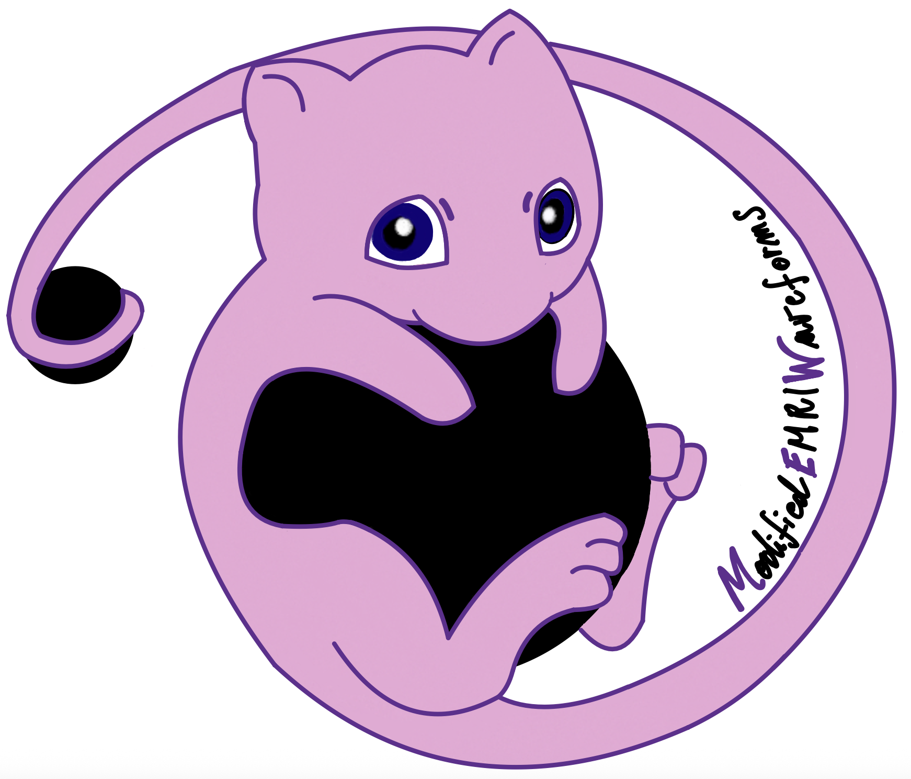

# ModifiedEMRIWaveforms

<table>
  <tr>
    <td valign="middle">
      
    </td>
    <td valign="top" style="padding-left: 20px;">

<p>
ModifiedEMRIWaveforms (MEW) is a Python package for gravitational waves from asymmetric binaries with scalar fields, building on 
<a href="https://github.com/BlackHolePerturbationToolkit/FastEMRIWaveforms">FastEMRIWaveforms (FEW)</a>.
</p>

  </tr>
</table>

If you make use of this repository, please see the <a href="#citation">citation section</a> below, together with the citation section in 
<a href="https://github.com/BlackHolePerturbationToolkit/FastEMRIWaveforms?tab=readme-ov-file#citation">FastEMRIWaveforms</a>.

## Set up 

To make use of this repository and produce waveforms from asymmetric binaries with scalar fields, you need to install [FastEMRIWaveforms](https://github.com/BlackHolePerturbationToolkit/FastEMRIWaveforms?tab=readme-ov-file#citation) first. A detailed installation guide can be found in the [official documentation](https://fastemriwaveforms.readthedocs.io/en/stable/). 

We recommend installing FEW in a conda environment. Once FEW is installed, you can clone this repository and install it in the same environment: 

```
git clone https://github.com/susannabarsanti/ModifiedEMRIWaveforms.git
cd ModifiedEMRIWaveforms
pip install .
```
Alternatively, you can download the repository as a ZIP archive from GitHub.

## Repository Structure
The files in ModifiedEMRIWaveforms include: 
- mew/flux.py : python script containing the trajectory class 
- mew/data/ : data folder containing the fluxes for trajectory production
- notebooks/example.ipynb : interactive notebook demonstrating how to run the code

## Trajectory: KerrCircEqFluxScalar
The class KerrCircEqFluxScalar build equatorial circular trajectories around Kerr black holes. The domain of validity is the same of FEW v2.0.0 for eccentricity e=0, namely
- the semi-latus rectum ranges from the separatrix up to 200M;
- the primary spin ranges between -0.999M and 0.999M. 

A retrograde (prograde) trajectory is obtained by choosing the input parameters such that the primary spin a and the orbital inclination x have opposite (equal) signs. \
In the presence of a scalar charge \(d\) carried by the secondary object, the value of the squared scalar charge $d^2$ is passed to the trajectory as the first additional parameter. 

## Data
The scalar fluxes have been computed with [STORM](https://github.com/saragliorio/STORM) with an accuracy of $10^{-8}$.

## Usage 
Once the repository is installed, you can produce your modified waveform in a python script by importing the class as
```
from mew import KerrCircEqFluxScalar
```
You can now use the trajectory class in FEW, for instance: 
```
from few.waveform import GenerateEMRIWaveform

inspiral_kwargs = {
    'flux_output_convention':'pex',
    'func':KerrCircEqFluxScalar
    }

Kerr_waveform = GenerateEMRIWaveform(
        "FastKerrEccentricEquatorialFlux",
        sum_kwargs=dict(pad_output=True),
        inspiral_kwargs = inspiral_kwargs,
        use_gpu=use_gpu,
        return_list=False,
    )

emri_params = [
    M,
    mu,
    a,
    p0,
    e0,
    x_I0,
    dist,
    qS,
    phiS,
    qK,
    phiK,
    Phi_phi0,
    Phi_theta0,
    Phi_r0,
]

Lambda = d**2 #squared scalar charge
add_params = [Lambda]

waveform_kwargs = {
    "T": Tobs,
    "dt": dt
}

Kerr_waveform = Kerr_waveform(*emri_params, *add_params, **waveform_kwargs)
```

For further details, see notebooks/example.ipynb. 

## Software release

This repository is archived on Zenodo and each software release is assigned a DOI.

## Citation

If you use this code in your research, please cite the software release on [Zenodo]. Please make sure to also cite the C++ code use to produce the data, [STORM](https://github.com/saragliorio/STORM), with the related paper. The references are provided in papers.bib. You can find the citation information in the `CITATION.cff` file in this repository.

## Acknowledgements

This code builds upon the
[FastEMRIWaveforms](https://github.com/BlackHolePerturbationToolkit/FastEMRIWaveforms)
framework developed by the [Black Hole Perturbation Toolkit](https://bhptoolkit.org).

